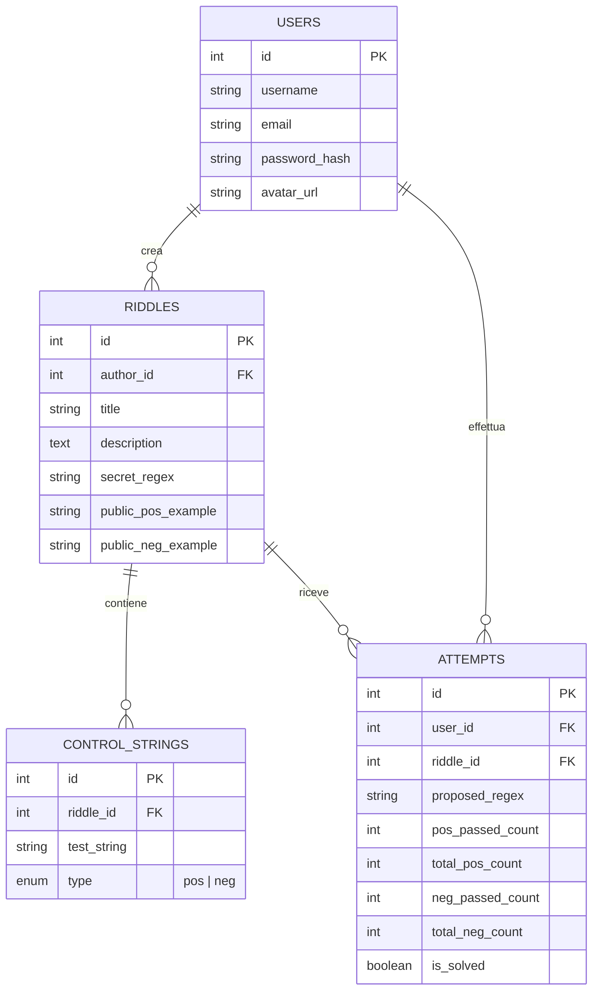
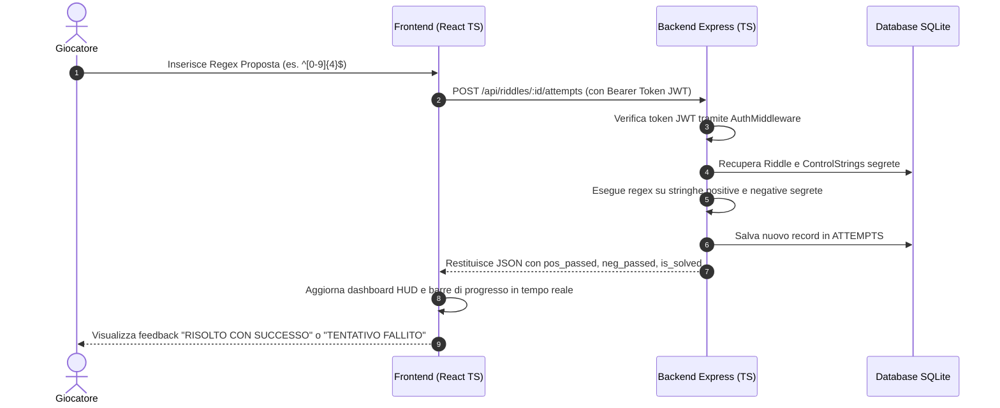

# 📖 Documentazione Tecnica: Come Funziona RegexRiddle

Benvenuto nella documentazione tecnica ed architetturale di **RegexRiddle**. 
Questo documento spiega nel dettaglio il funzionamento del motore di sfida, le regole di dominio, l'architettura full-stack in **TypeScript**, i modelli di dati e i flussi end-to-end.

---

## 1. Visione Generale del Progetto

**RegexRiddle** è una piattaforma di hacking logico orientata alla scoperta ed al testing di **Espressioni Regolari (RegEx)**.

A differenza delle tradizionali piattaforme in cui agli utenti viene fornito il pattern e viene chiesto di trovare la stringa corrispondente, in **RegexRiddle** il processo è invertito:
1. **L'Autore** crea un enigma definendo una **Regex Segreta** ed aggiungendo un insieme di **stringhe di controllo segrete** (positive e negative).
2. **I Giocatori** vedono solo la descrizione dell'enigma e 2 esempi pubblici (1 positivo e 1 negativo).
3. **Il Giocatore** propone la propria Regex per scoprire il pattern segreto.
4. **Il Motore del Server** valuta la Regex del giocatore sulle stringhe di controllo segrete e calcola istantaneamente il tasso di successo.

---

## 2. Logica di Dominio & Regole di Gioco

### 2.1 Componenti di un Enigma (`Riddle`)
Ogni enigma salvato nel database contiene i seguenti campi fondamentali:
- **Titolo & Descrizione**: Il testo esplicativo visibile ai giocatori.
- **Regex Segreta dell'Autore (`secret_regex`)**: L'espressione regolare originale concepita dall'autore (memorizzata nel DB e mai inviata al client).
- **Esempio Positivo Pubblico (`public_pos_example`)**: Una stringa di esempio che DEVE matchare con la regex.
- **Esempio Negativo Pubblico (`public_neg_example`)**: Una stringa di esempio che NON DEVE matchare con la regex.
- **Vettori di Controllo Segreti (`control_pos_strings` & `control_neg_strings`)**:
  - Da 1 a 10 stringhe **Positive** (devono matchare).
  - Da 1 a 10 stringhe **Negative** (non devono matchare).

---

### 2.2 Algoritmo di Valutazione dei Tentativi (`Attempt Engine`)

Quando un utente invia una Regex proposta $R_{prop}$ per l'enigma $E$:

1. **Sintassi & Compilazione**:
   Il server tenta di istanziare la regex in JavaScript:
   ```typescript
   const userRegex = new RegExp(proposedRegex);
   ```
   Se la sintassi della regex proposta non è valida, viene restituito immediatamente un errore sintattico.

2. **Matching sulle Stringhe Positive Segrete**:
   Il server itera su tutte le $N_{pos}$ stringhe di controllo positive $S_{pos, i}$:
   $$\text{passed}_{pos} = \sum_{i=1}^{N_{pos}} \mathbb{I}\left(R_{prop}.\text{test}(S_{pos, i}) == \text{true}\right)$$

3. **Matching sulle Stringhe Negative Segrete**:
   Il server itera su tutte le $N_{neg}$ stringhe di controllo negative $S_{neg, j}$:
   $$\text{passed}_{neg} = \sum_{j=1}^{N_{neg}} \mathbb{I}\left(R_{prop}.\text{test}(S_{neg, j}) == \text{false}\right)$$

4. **Criterio di Risoluzione (`is_solved`)**:
   L'enigma si considera **risolto con successo** se e solo se:
   $$\text{passed}_{pos} == N_{pos} \quad \text{AND} \quad \text{passed}_{neg} == N_{neg}$$

Se entrambe le condizioni sono verificate, il tentativo viene contrassegnato con `is_solved = 1`, e l'utente guadagna il completamento dell'enigma.

---

### 2.3 Algoritmo della Classifica (`Global Leaderboard`)

La classifica globale ordina gli utenti registrati secondo **due criteri in ordine di priorità (Lexicographical Ranking)**:

1. **Priorità 1 — Numero di Enigmi Distinti Risolti (`riddles_solved`)**:
   Ordina in modo decrescente gli utenti che hanno risolto il maggior numero di enigmi unici.
2. **Priorità 2 — Minor Numero Medio di Tentativi (`avg_attempts`)**:
   In caso di parità sul numero di enigmi risolti, prevale l'utente che ha impiegato **meno tentativi in media** per ciascun enigma risolto:
   $$\text{avg\_attempts} = \frac{\text{Totale Tentativi Invati dall'Utente sugli Enigmi Risolti}}{\text{Numero di Enigmi Risolti dall'Utente}}$$

---

## 3. Architettura Backend (Node.js + Express + Sequelize + TypeScript)

Il backend segue il pattern **MVC (Model-View-Controller)** totalmente convertito in **TypeScript** con type safety rigorosa.

```text
backend/src/
├── config/database.ts     # Inizializzazione Sequelize SQLite
├── controllers/           # Gestione delle richieste HTTP
│   ├── authController.ts
│   ├── riddleController.ts
│   ├── attemptController.ts
│   ├── profileController.ts
│   └── leaderboardController.ts
├── db/                    # Seeding e file SQLite database
├── middleware/            # Auth JWT (authMiddleware.ts) & Upload (uploadMiddleware.ts)
├── models/                # Modelli relazionali Sequelize
│   ├── User.ts
│   ├── Riddle.ts
│   ├── ControlString.ts
│   └── Attempt.ts
├── routes/                # Rotte RESTful (/api/auth, /api/riddles, ecc.)
├── services/              # Regex evaluation engine & query aggregazioni
└── server.ts              # Entry point Express.js
```

### 3.1 Modello Relazionale dei Dati (Database ER)



---

## 4. Architettura Frontend (React + Vite + TypeScript)

Il frontend è sviluppato come **Single Page Application (SPA)** in **React 18 + TypeScript**, con un design system **Vanilla CSS** stile **Cyberpunk 2077 HUD & Retro Arcade**.

```text
frontend/src/
├── components/            # Componenti Navbar, Footer, PixelIcons
├── context/               # AuthContext.tsx (Stato autenticazione utente)
├── pages/                 # Pagine SPA
│   ├── HomePage.tsx
│   ├── RiddlesPage.tsx
│   ├── RiddleDetailPage.tsx
│   ├── CreateRiddlePage.tsx
│   ├── LeaderboardPage.tsx
│   ├── ProfilePage.tsx
│   └── RulesPage.tsx
├── services/              # Client API HTTP Axios/Fetch
├── types/                 # Type interfaces TypeScript (User, Riddle, Attempt)
├── index.css              # Design System HUD Cyberpunk (CRT scanlines, neon, glass)
└── main.tsx               # Bootstrapping React
```

### 4.1 Caratteristiche del Design System Cyberpunk
- **Font Typographic Stack**:
  - `Orbitron`: Per titoli HUD, loghi e intestazioni al neon.
  - `JetBrains Mono`: Per i blocchi di codice, espressioni regolari e stringhe di test.
  - `Press Start 2P`: Per trofei pixel ed elementi arcade.
- **Terminali CRT**: Effetto scanline ottenuto tramite gradienti lineari sovrapposti e neon glow verde/rosa.
- **Top 3 Cyber Podium**: Carte podium tridimensionali illuminate in Oro, Argento e Bronzo.

---

## 5. Flusso Dati End-to-End



---

## 6. Guida ai Comandi Utili

| Comando | Ambiente | Descrizione |
|---|---|---|
| `npm run dev` | `backend/` | Avvia il server backend con ricaricamento automatico (`tsx watch`). |
| `npm run seed` | `backend/` | Inizializza il database SQLite con dati dummy di test. |
| `npm test` | `backend/` | Esegue i test di integrazione ed unità Jest. |
| `npm run dev` | `frontend/` | Avvia l'ambiente di sviluppo Vite con HMR. |
| `npm run build` | `frontend/` | Compila il codice TypeScript ed esegue il bundling per la produzione. |

---

## 🎓 Note per la Valutazione Accademica

- **Modularità**: Netta separazione tra backend MVC RESTful e client frontend React SPA.
- **Type Safety**: Copertura TypeScript al 100% sia lato backend che frontend per prevenire errori a runtime.
- **Sicurezza**: Cifratura password (Bcrypt), autenticazione tramite JWT token, disabilitazione del rendering delle regex segrete verso il client.
- **UX/UI**: Cura maniacale dell'estetica con un tema Cyberpunk originale, responsive e accessibile.
